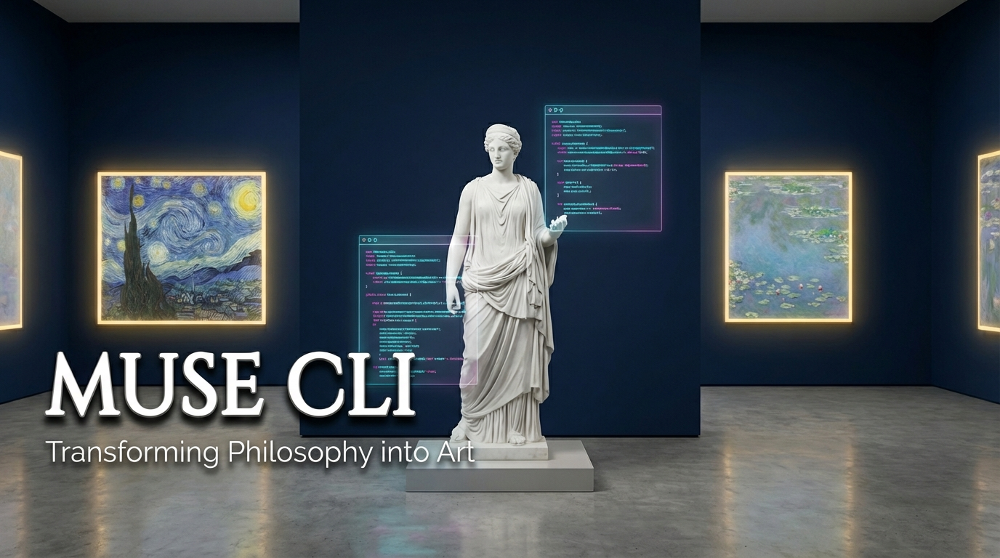

# Muse CLI

<p align="center">
  
</p>

A Python CLI tool that interprets abstract philosophical text into art search keywords using Google Gemini, and searches for artwork across multiple renowned art galleries including the Metropolitan Museum of Art, WikiArt, and Meisterdrucke.

## Features

- **AI-Powered Interpretation**: Uses Google Gemini (gemini-2.0-flash-exp) to convert philosophical quotes into art search keywords
- **Multiple Art Gallery Sources**: Search from 3 different galleries:
  - **Meisterdrucke** (via Apify web scraping)
  - **Metropolitan Museum of Art** (official API, 470,000+ artworks, no key needed)
  - **WikiArt** (official API, 250,000+ artworks, no key needed)
- **Beautiful CLI**: Rich terminal UI with tables, spinners, and clickable links
- **Usage Tracking**: Monitor your Gemini API usage against free tier limits (15 RPM, 1,500 requests/day, 1M tokens/day)
- **Timeout Protection**: Handles API timeouts gracefully

## Prerequisites

- Python 3.8 or higher
- Google Gemini API key (required)
- **Optional**:
  - Apify API token (only if using Meisterdrucke source)
  - Met Museum & WikiArt require no API keys!

## Installation

1. Clone this repository:
```bash
git clone https://github.com/ewijaya/muse-cli.git
cd muse-cli
```

2. Install the package:
```bash
pip install -e .
```

This installs `muse` as a global command that you can run from anywhere.

3. Set up environment variables in your `~/.zshrc` or `~/.bashrc`:
```bash
# Required
export GEMINI_API_KEY="your-gemini-api-key"

# Optional - only if using Meisterdrucke
export APIFY_TOKEN="your-apify-api-token"
```

4. Reload your shell configuration:
```bash
source ~/.zshrc  # or source ~/.bashrc
```

## Usage

### Search for artwork

```bash
muse search "In the depths of solitude, light finds its way"
```

You can search from any directory! The AI will interpret your philosophical text and find matching artwork.

### Choose your art gallery source

By default, Muse searches Meisterdrucke. You can choose from 3 different galleries:

```bash
# Search Metropolitan Museum of Art (no API key needed!)
muse search "impressionism monet" --source met

# Search WikiArt (no API key needed!)
muse search "starry night" --source wikiart

# Search Meisterdrucke (default, requires Apify token)
muse search "van gogh" --source meisterdrucke
```

### Search by painting or artist

```bash
muse search "Starry Night by Van Gogh"
muse search "dreaming girl"
muse search "impressionism monet"
```

### Options

- `--source`, `-s`: Art gallery source: `meisterdrucke`, `met`, `wikiart` (default: meisterdrucke)
- `--max`, `-m`: Maximum number of artworks to return (default: 10)
- `--timeout`, `-t`: Timeout for AI generation in seconds (default: 30)

```bash
muse search "Beauty is truth, truth beauty" --source met --max 5 --timeout 60
```

### Show version

```bash
muse version
```

### Monitor API usage

Track your Gemini API usage against the free tier limits:

```bash
muse usage
```

This displays:
- Today's request count and token usage
- All-time statistics
- Percentage of free tier limits used
- Warnings if approaching or at limits
- Free tier limit details (15 RPM, 1,500 requests/day, 1M tokens/day)

**Note**: Usage tracking is based on estimates. Actual API usage may vary slightly.

## Project Structure

```
muse-cli/
├── pyproject.toml   # Package configuration & entry point
├── interpreter.py   # AI layer - Google Gemini integration
├── curator.py       # Scraper layer - Apify integration for Meisterdrucke
├── gallery_apis.py  # API layer - Met Museum & WikiArt integrations
├── usage_tracker.py # Usage tracking - Monitor API usage
├── main.py          # CLI interface - Typer & Rich UI
├── requirements.txt # Python dependencies
└── README.md        # Documentation
```

## How It Works

1. **Input**: You provide an abstract philosophical quote
2. **Interpretation**: Google Gemini converts it into art-related search keywords
3. **Search**: Your chosen gallery source is queried for matching artwork:
   - **Meisterdrucke**: Apify scrapes the gallery website
   - **Met/WikiArt**: Official museum APIs are called
4. **Display**: Results are shown in a beautiful terminal table with clickable links

## API Keys

### Getting a Gemini API Key (Required)

1. Visit [Google AI Studio](https://makersuite.google.com/app/apikey)
2. Sign in with your Google account
3. Create a new API key

### Getting an Apify API Token (Optional - for Meisterdrucke)

1. Visit [Apify Console](https://console.apify.com/)
2. Sign up or log in
3. Go to Settings > Integrations > API tokens
4. Create a new token

### No API Key Needed

- **Met Museum**: Free, no authentication required
- **WikiArt**: Free, no authentication required

## License

MIT
